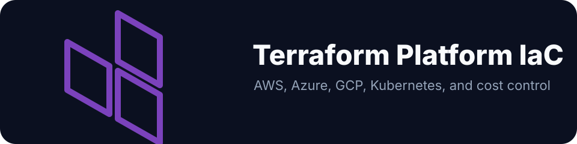

# Terraform



Infrastructure-as-code across on-premises, AWS, Azure, and GCP. Reusable modules and environment-specific workflows covering EKS, AKS, GKE, Apigee, PrivateLink, S3 tiering, observability, and logging pipelines.

The S3 lifecycle module alone delivered **$X/year in cost savings** by tiering ~N PB of Telemetry log data to Glacier Deep Archive across multiple regions.


Commercial angle and consulting hooks: [docs/go-to-market.md](docs/go-to-market.md).

> **Note:** All company-specific values (account IDs, hostnames, ARNs, VPC CIDRs) are replaced with generic placeholders. The module design and implementation reflect actual production work.

---

## Design principles

**Separation of concerns at every layer.** Helm release versions, replica counts, and chart config live in Terraform, not ad-hoc `helm upgrade` commands. ConfigMaps that drive runtime behavior are Terraform resources with full audit trail and PR-based change control.

**Ephemeral state handled at the IaC layer.** Pod IPs are transient. Rather than fighting this, modules use `data "kubernetes_pod_v1"` to query live cluster state and converge AWS resources (NLB target groups) to match. Every `terraform apply` is a reconciliation loop.

**Least-privilege exposure by design.** PrivateLink keeps cross-account traffic off the public internet. Separate NLB target groups per gateway type enforce protocol-level isolation. `target_type = ip` bypasses NodePort NAT and preserves source IP end-to-end.

**Everything version-controlled, nothing click-ops.** IAM roles, Cognito federation, Grafana alert rules, ACR cleanup tasks: all Terraform resources. If it can't be reviewed in a PR and rolled back with a revert, it doesn't exist in production.

---

## Structure

```
AWS/
├── modules/
│   ├── eks/               multi-account EKS: OIDC, CNI custom networking, Linux/Windows node groups
│   ├── privatelink/       cross-account endpoint service + consumer (SSH/ADB, MSK, internal APIs)
│   ├── s3_lifecycle/      Standard → IA → Glacier Deep Archive, KMS enforcement
│   ├── grafana_alerting/  Grafana rules for ALBs (5XX, P99), MSK, SQS, PrivateLink
│   ├── nginx_ingress/     NGINX on NLB, TCP ConfigMap, dynamic pod IP NLB target registration
│   ├── sqs_sns/           SQS + SNS with DLQ, FIFO, cross-service subscriptions
│   └── opensearch/        OpenSearch with Cognito/SAML SSO + Azure AD OIDC
└── workflows/
    ├── deploy_eks/        EKS cluster provisioning (EKS Auto Mode, Helm/K8s providers)
    ├── blue_green_eks/    zero-downtime EB → EKS via ALB weighted target groups
    └── opensearch_migration/ on-prem ES → AWS OpenSearch with Cognito + Azure AD SSO

Azure/
├── modules/
│   ├── aks/               Azure AD RBAC, workload identity, ACR integration, Container Insights
│   └── acr/               geo-replication, weekly untagged image cleanup Task
└── workflows/
    └── deploy_aks_logging/ FluentBit → Event Hubs → Logstash → OpenSearch → Grafana

GCP/
├── modules/
│   ├── apigee/            Apigee X org + env + instance; JS token auth; path routing; SpikeArrest
│   ├── gke/               private cluster: Workload Identity, Binary Authorization, Shielded Nodes
│   └── gcs_lifecycle/     Standard → Nearline → Coldline → Archive with CMEK
└── workflows/
    └── deploy_apigee_proxies/ DeviceService, PackageService, InferenceService proxies with token auth + path routing
```

---

## AWS Modules

### `modules/s3_lifecycle`

Tiered storage that saved $X/year on N PB of Telemetry log data:

```hcl
module "telemetry_logs" {
  source = "./AWS/modules/s3_lifecycle"

  bucket_name                = "telemetry-logs-prod"
  environment                = "prod"
  log_prefix                 = "telemetry-logs/"
  transition_to_glacier_days = 90
  kms_key_arn                = var.kms_key_arn
  enforce_encryption_policy  = true
  replication_regions        = ["ap-south-1", "eu-central-1"]
}
```

### `modules/eks`

Multi-account EKS with VPC CNI custom networking, OIDC federation, mixed Linux/Windows node groups:

```hcl
module "eks" {
  source = "./AWS/modules/eks"

  cluster_name    = "platform-prod"
  cluster_version = "1.31"
  environment     = "prod"
  vpc_id          = "vpc-0abc123"
  subnet_ids      = ["subnet-aaa", "subnet-bbb"]

  cni_custom_networking_enabled = true
  eni_config_subnets = {
    "us-west-2a" = "subnet-100a"
    "us-west-2b" = "subnet-100b"
  }

  linux_node_groups = {
    general = {
      instance_types = ["m6i.xlarge"]
      min_size       = 2
      max_size       = 10
      desired_size   = 3
      capacity_type  = "ON_DEMAND"
    }
  }
}
```

### `modules/nginx_ingress`

NGINX on NLB for the DeviceService SSH/ADB gateway and device streaming. The hard problem is ephemeral pod IPs: NLB `target_type = ip` registers pod IPs directly (preserves source IP for SSH auth), but pod IPs change on every rollout. The module uses `data "kubernetes_pod_v1"` + `for_each` so every `terraform apply` re-syncs NLB targets to actual pod state.

```
Traffic path:
  Consumer VPC
    └─ VPC Endpoint (PrivateLink)
         └─ NLB (internal)
              ├─ Target Group: ssh_adb (port 22, target_type=ip)
              │    └─ pod IPs registered dynamically via for_each
              └─ Target Group: device_streaming (port 443, target_type=ip)
                   └─ source IP sticky → NGINX TCP stream → pod
```

### `modules/grafana_alerting`

Terraform-managed Grafana alerts across 10 ALBs and 4 AWS services in 5 environments:

```hcl
module "grafana_alerts" {
  source = "./AWS/modules/grafana_alerting"

  environment        = "prod"
  alb_arn_suffixes   = [module.alb_device_service.arn_suffix, module.alb_inference_service.arn_suffix]
  alb_5xx_threshold  = 10
  alb_latency_p99_ms = 2000
  msk_cluster_name   = "iot-platform-prod"
  sqs_queue_names    = ["event-queue-prod", "release-queue-prod"]
  slack_webhook_url  = var.slack_webhook
}
```

---

## Azure

### `modules/aks`

AKS with Azure AD RBAC, workload identity (OIDC issuer), ACR pull role, Container Insights, auto-scaling node pools.

### `workflows/deploy_aks_logging`

Full IoT telemetry logging stack:

| Component | Role |
|---|---|
| FluentBit DaemonSet | Tails all pod logs → Event Hubs (Kafka protocol) |
| Azure Event Hubs | Kafka-compatible message bus |
| Logstash | Parses, enriches, indexes to OpenSearch |
| OpenSearch (on AKS) | Log storage and full-text search |
| Grafana | Dashboards, internal LoadBalancer |

---

## GCP

### `modules/apigee`

Full Apigee X setup. Proxy bundles rendered from templates via `archive_file`. Each bundle includes JS-ValidateToken (Bearer token introspection), JS-PathRouter (dynamic `target.url`), and SpikeArrest (600 req/min).

Consolidated many fragmented proxies to a smaller set (a large reduction), simplifying auth and routing logic across the org.

Separately, resolved a production latency incident on this Apigee org (paged for InferenceService workflows hitting the Storage API): scaled the backend HPA to 10 pods as an immediate mitigation, cutting p99 latency from N ms to M ms (a large reduction). A follow-up Apigee version and Kubernetes cluster upgrade, done with the platform team, brought it down further to a target SLA.

### `modules/gke`

Private, VPC-native GKE with Workload Identity, Binary Authorization, Shielded Nodes, and REGULAR release channel auto-upgrades.

### `workflows/deploy_apigee_proxies`

DeviceService, PackageService, InferenceService proxies in production:

| Proxy | Base Path | Routes |
|---|---|---|
| DeviceService | `/device_service/v2` | `/devices`, `/ssh`, `/workspaces`, `/builds` |
| PackageService | `/package_service/v2` | `/packages`, `/download`, `/catalog`, `/releases` |
| InferenceService | `/inference_service/v2` | `/models`, `/inference`, `/benchmarks`, `/compile`, `/profile` |

---

## License

MIT
